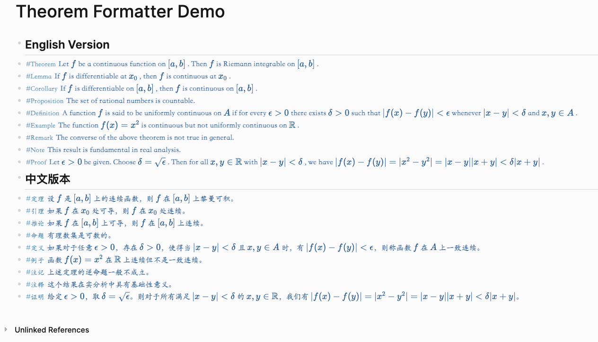

# Logseq Theorem Formatter

A Logseq plugin that formats theorem-like blocks with customizable styles and supports both English and Chinese theorem environments.

## Features

- **Bilingual Support**: Use theorem environments in English, Chinese, or both languages
- **Customizable Environments**: Define your own theorem environments for both English and Chinese
- **Flexible Styling**: Customize font, colors, borders, and spacing
- **Math Formula Support**: Preserves proper formatting for mathematical formulas
- **Real-time Updates**: Automatically formats blocks as you type

## Screenshots



## Installation

1. Go to Logseq Settings
2. Navigate to Plugins
3. Search for "Theorem Formatter"
4. Click Install

## Usage

### Basic Usage

1. Create a block with a theorem environment tag (e.g., `#Theorem` or `#定理`)
2. The block will be automatically formatted according to your settings

### Example Blocks

```
#Theorem
This is a theorem block.

#Lemma
This is a lemma block.

#定理
这是一个定理块。

#引理
这是一个引理块。
```

### Language Settings

The plugin supports three language modes:
- English only (`en`)
- Chinese only (`zh`)
- Both languages (`both`)

### Customizing Environments

You can customize theorem environments for both English and Chinese:

1. Go to Plugin Settings
2. Under "English Theorem Environments", enter your custom environments separated by commas
3. Under "Chinese Theorem Environments", enter your custom Chinese environments separated by commas

Default English environments:
```
Theorem, Lemma, Corollary, Proposition, Definition, Example, Remark, Note, Proof
```

Default Chinese environments:
```
定理, 引理, 推论, 命题, 定义, 例子, 注记, 注释, 证明
```

### Styling Options

Customize the appearance of your theorem blocks:

- **Font Family**: Choose your preferred font (e.g., "KaiTi", "楷体", "STKaiti", "华文楷体", serif)
- **Font Size**: Set the size of the text
- **Font Weight**: Choose from normal, bold, or various weights
- **Font Style**: Select normal, italic, or oblique
- **Text Color**: Set the color of the text
- **Background Color**: Choose the background color
- **Border**: Customize border color, width, and style
- **Spacing**: Adjust padding and margin
- **Border Radius**: Set the corner roundness

## Development

### Prerequisites

- Node.js 16 or later
- npm or yarn

### Setup

1. Clone the repository
2. Install dependencies:
   ```bash
   npm install
   ```
3. Start development:
   ```bash
   npm run dev
   ```

### Building

To build the plugin:
```bash
npm run build
```

## License

MIT

## Contributing

Contributions are welcome! Please feel free to submit a Pull Request.

## Submitting to Logseq Marketplace

To submit this plugin to the Logseq marketplace:

1. Fork the [Logseq marketplace repository](https://github.com/logseq/logseq-plugin-samples)
2. Create a new directory for your plugin in the `plugins` folder
3. Copy your `manifest.json` file to the new directory
4. Create a pull request with the following:
   - Clear description of your plugin
   - At least one screenshot or GIF demonstrating the plugin
   - Ensure your SDK is up to date
   - Attach the release zip file

### Release Process

1. Update version in `package.json`
2. Build the plugin:
   ```bash
   npm run build
   ```
3. Create a new release on GitHub:
   - Tag version (e.g., v1.0.0)
   - Title: "Release v1.0.0"
   - Description: List of changes
   - Attach the built zip file from `dist/logseq-theorem-formatter.zip`

The GitHub Action will automatically:
1. Build the plugin
2. Create a zip file
3. Upload it as a release asset

After your pull request is approved, the plugin will be available in the Logseq marketplace.